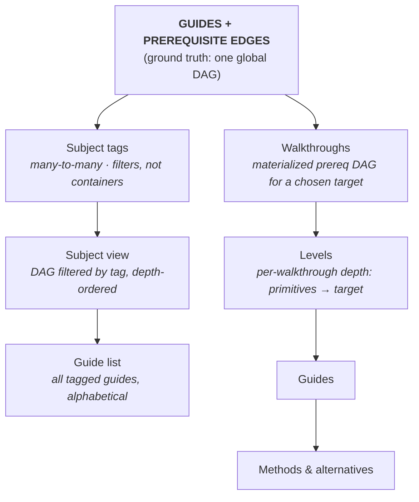
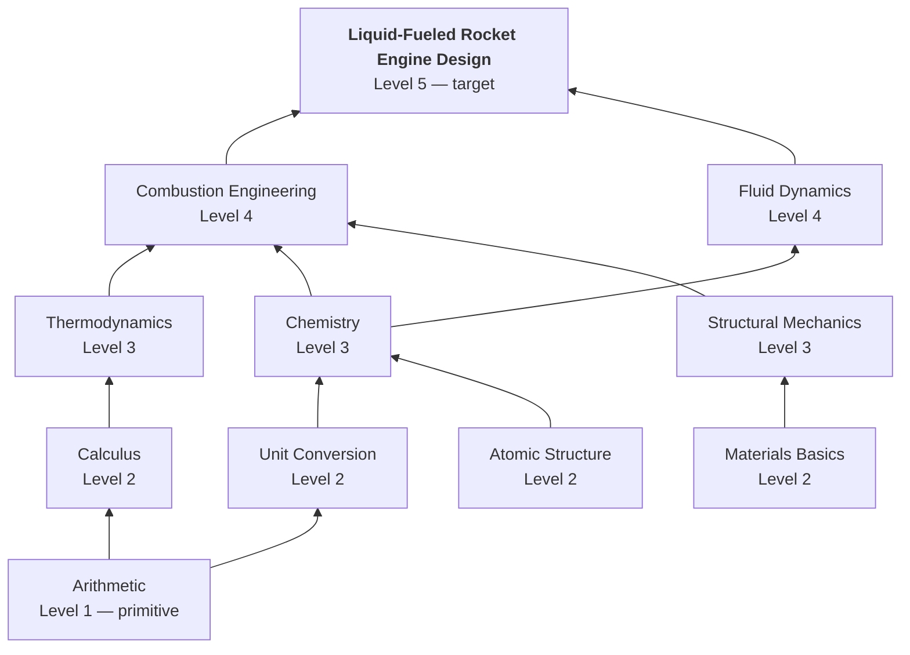

# Overall System

## Ground Truth: Guides + Prerequisite Edges

BLUE's underlying structure is a **directed acyclic graph (DAG)** of guides connected by prerequisite edges. Not a tree. Not a collection of separate hierarchies. One graph.

- A **guide** is a node.
- A **prerequisite edge** from A → B means "you must understand A before B."
- Subjects, walkthroughs, and levels are **derived views** on top of this graph (not separate hierarchies stored alongside it).

This is what lets BLUE fit any kind of knowledge: a guide can have many prerequisites and many dependents, and the same guide can play different roles in different contexts (e.g. Quaternions = an endpoint in math, a prerequisite in 3D animation).

## Terms

- **Guide**: The canonical how-to content unit for a single topic. Exactly one canonical guide per topic. A guide is a node in the global prerequisite graph. Low-level guides must be goal-agnostic (cannot assume a specific end goal) so they remain reusable as prerequisites for many dependents (high-level guides can start to branch off and be more specific).
- **Prerequisite (prereq)**: For guide B, any guide with an edge into B is a prerequisite. With A → B, A is a prereq of B.
- **Dependent**: For guide A, any guide that requires A as a prereq is a dependent. With A → B, B is a dependent of A.
- **Subject**: A **tag** applied to guides (e.g. math, physics, vehicles). A guide can carry many subject tags. Subjects are not containers and do not own guides but rather filters/views over the global graph. A subject may declare a **prerequisite floor** (e.g. "physics subject floor = arithmetic + algebra") that applies to its tagged subgraph → you could technically just link up those prerequsite edges into the subject, but the idea of the floor is to keep the subject less bloated and prevent an infinite spiral of low-level dependencies.
- **Subject view**: The global graph filtered to guides carrying a given subject tag, listed alphabetically. This is what users browse when they "explore math." 
- **Walkthrough**: A materialized part of the graph: pick a target guide, compute its transitive prerequisite DAG, optionally filter by subject tag, render bottom-up. Most walkthroughs are auto-generated on demand from a chosen target. Users should also be able to save these walkthroughs locally.
- **Hierarchy**: The leveled shape of a walkthrough. Guides are grouped into levels where every guide at level N depends only on guides at levels below N. Guides at the same level are independent of each other and can be completed in any order.
- **Level**: A computed depth position within a walkthrough (level 1 = primitives with no prereqs in this walkthrough; highest level = the target). The level of a guide = longest prerequisite path to it from a primitive in this walkthrough. Per-walkthrough only — the same guide can sit at different levels in different walkthroughs depending on what else is included.
- **Learning path**: A **curated, versioned** curriculum authored on top of the graph. A curator picks one or more **targets**, the system seeds the prerequisite DAG beneath them, and the curator can then **skip** topics, **choose a specific guide variant** for each kept topic, and writes path metadata before submitting it for review. Unlike a walkthrough (auto-generated fresh on every open), a published learning path **revision** is a frozen snapshot reviewed by a verifier panel.
- **Alternative**: A competing *theoretical* framing of the same topic inside a canonical guide (e.g. a different model, proof strategy, or conceptual lens). Alternatives live inside their parent guide, each with its own page and URL. Learner **upvotes and downvotes** rank alternatives against each other; strong sustained preference can promote one to the main guide content.
- **Method**: A competing *practice* route to the same outcome inside a canonical guide (e.g. a different procedure, toolchain, or technique). Methods live inside their parent guide, each with its own page and URL. Learner **upvotes and downvotes** rank methods against each other; strong sustained preference can promote one to the main guide content.
- **Verifier**: A community member authorized to review guide submissions and modifications before publish. Verifiers are not required to be subject experts; their job is to check hierarchy soundness, catch obvious errors, prevent duplication, and apply the same structural checks to new methods and alternatives parented under a guide. Verifier discretion is deliberately constrained: decisions are rubric-bound, panel-based, justified in writing, and publicly logged. See the Guide Creation & Verification section below.
- **Moderator**: A community member who handles post-publish guide review. Moderators see the full vote-rubric breakdown (both whole-guide and per-section), sit on re-review panels when a guide trips a re-review trigger, and sit on dispute panels. Moderator panels are odd-numbered, randomly drawn from the eligible pool, rubric-bound, and require written justifications on the same discipline as verifier panels. Subject-expert credentialing for moderators (and verifiers) is layered on later as the verifier-style credentialing system comes online.

## Discovery Flow

How a learner finds something to learn:

1. **Subject browse.** User picks a subject tag (e.g. "math"). System renders all of that subject's guides in **alphabetical order**.
2. **Pick a target.** User picks any guide as a learning target (e.g. "Quaternions," "Putnam-level Combinatorics").
3. **Walkthrough materializes.** System computes the prerequisite DAG from primitives up to that target, filtered by the subject context, and renders it as an ordered climb.
4. **Climb.** User works upward. Each guide shows its direct prereqs and direct dependents, plus its subject tags.

Users never see the whole graph at once (unless we later implement "Bird's Eye" which show all the hierarchies and guides on the entire site). The reader's screen always shows: one guide + a small neighborhood + its tags.

## Why Not a Single Big Tree

- A tree forces every guide to have one parent, which forces information to be under one subject. This would lead to many problems, as many guides span many subjects: cryptography sits between math and computer science; quaternions sit between math, physics, and 3D animation.
- Subject membership is many-to-many. The same guide should appear in every subject view it belongs to, without duplication.

## Why Not a Pure Graph With No Subjects

- Without subject tags, "explore math" or things alike have no entry point. 
- Subject tags allows an intuitive structure (browsing, alphabetical guide listing, scoped walkthroughs) without constraining guides to live in one place.

## Deduplication ("one canonical guide per topic")

Ways to prevent duplicate guides:

1. **Autocomplete search while writing a new guide title** (including synonyms): "Did you mean *X*?"
2. **A similarity warning at submit time** catches near-duplicates, even when titles are different.
3. **Verifier review before publish** includes a duplicate check, so duplicates can be rejected.

## Cross-Subject Conflicts

When two subjects both tag the same guide and their subject communities disagree on its content, the resolution is a **spin-off**: the guide forks into two subject-specific versions. This is an explicit, governed exception to "one canonical guide per topic," handled by the dispute system. See `open-questions.md` §7.2.

## Hierarchy (Conceptual)

Note: users will usually pick a target from the subject's guide list and then materialize a walkthrough, but walkthrough generation is conceptually separate from the subject-list view.

## Walkthrough Hierarchy Structure Example

Here is a walkthrough example of liquid-fueled rocket engine design:

**Key constraints:**

- A guide at level N can only depend on guides at levels < N within the walkthrough. No forward references.
- Level numbers are computed from the DAG, not declared by authors. The level of a guide = longest prerequisite path to it from a primitive in this walkthrough.
- Multiple guides at the same level are independent of each other.
- Guides are shared. "Calculus" at level 2 of this walkthrough is the same node as "Calculus" in any other walkthrough that needs it. No duplication.
- The target is always the sole guide at the highest level. If a chosen target has multiple terminal dependents, the user is asked to pick one.

**Why this shape matters:**

Learners always know where they are. "I'm at level 3 of 5" is concrete. Each level is a clear milestone: complete all guides at level N, then all guides at level N+1 become unlocked. The hierarchy imposes order without being a rigid linear path — guides at the same level are parallel, not sequential.

---

## Learning Paths

A **walkthrough** is computed fresh every time someone picks a target, whereas a **learning path** is the curated, human-authored curriculum that someone deliberately shaped in order to reach a certain goal or audience (e.g. "Guides to Become a Doctor" or "Machine Learning for High Schoolers").

### Traits

- **Versioned authored artifacts**: a path has revisions. Each revision is authored, submitted, reviewed, and published (similar to the lifecycle of guides).
- **Multiple targets**: learning path can contain several endpoints at once (e.g. Machine Learning *and* Statistics), unlike a single-target walkthrough.
- **Curators can skip prerequisites**: a curator may intentionally omit a prerequisite the DAG would otherwise include (e.g. drop Trig from an applied path). The omission is part of the authored curriculum, which does not affect the global graph.
- **Curators choose guide variants**: for each kept topic the curator pins a specific guide variant (a particular method or alternative), which best caters to particular goal or audience the curator is trying to target.
- **Published revisions are fully frozen snapshots**: once published, a revision's targets, included topics, chosen variants, and displayed structure are fixed. Later changes to the global DAG or to which guide is canonical do **not** alter an already-published path. A new revision is the only way to change a path.

### Authoring flow

1. **Pick targets.** The curator chooses one or more goal topics.
2. **System seeds the DAG.** The prerequisite closure beneath the targets is generated as a starting curriculum, with a default variant per topic.
3. **Curate.** The curator skips topics, swaps variants, annotates nodes, and writes the path's title/summary.
4. **Submit for review.** The revision goes to a **verifier** panel — the same pre-publish structural gate used for guides (hierarchy soundness, scope, duplication), since curation is a structural judgment, not post-publish moderation.
5. **Publish.** On approval the revision freezes, including its displayed graph, and becomes the path's live revision.

### Skipping a prerequisite (projection)

When a curator omits a topic, the path does **not** show a gap. The displayed graph is the global DAG **projected** onto the kept topics: if the real chain is `Algebra → Trig → Calculus` and Trig is skipped, the path renders a direct `Algebra → Calculus` edge. This is a presentation choice for that one curriculum — it does **not** claim Trig stopped being a prerequisite of Calculus. The global DAG remains the single source of truth for prerequisites; the path stores only a frozen *view* of it. Curators cannot draw arbitrary connections; every displayed edge is derived from real prerequisite edges.

### Why this stays consistent with one global DAG

A learning path is to the DAG what a walkthrough is: a packaging of prerequisite truth, not a redefinition of it. The only added wrinkle is that a path's packaging is **authored and frozen** rather than recomputed live, so the curator's intent (and the exact shape a panel approved) survives later graph edits. Prerequisite authority never moves off `guide_edges`.

### Not yet implemented

Post-publish governance of paths themselves — learner votes on a path, vote-triggered re-review, disputes against a curation, and content holds over a path — is deferred. The guides a path references are still individually governed; what is deferred is governance of the curation. See `docs/database-schema.md` for the schema-level deferral note.

---

## Guide Creation & Verification

The original model (subject-expert jury reviews every submission before publish) has a cold-start problem: it requires subject-expert reviewers to exist *before* the first guide can be published, which is precisely when no such pool exists. The revised model below decouples publishing from subject expertise. The publish-time gate is staffed by **verifiers**: careful readers applying a structural rubric, not subject experts. After publish, **moderators** handle continuous vote-based review and dispute resolution. Subject-expert credentialing is a layer added on top of these roles later, not a prerequisite to operating.

What "verified" means here is narrowed to the two properties that are load-bearing for a tutorial site: **correctness** (the guide teaches the topic without false claims, broken steps, or missing prerequisites) and **pedagogical soundness** (prerequisites are honest, no skipped steps, level-appropriate). Best-practice judgment and canonical-fit editorial polish are deferred — they will improve as the site grows, and structural design carries most of the canonical-fit weight already.

### Submission Paths

When a user wants to contribute:

1. **No canonical guide on the topic yet.** The user authors a fresh guide. Standard verifier queue.
2. **A canonical guide already exists.** The user may:
  - **Modify the canonical guide** (diff-style edits, reviewed by verifiers), or
  - **Add a method or alternative** under that guide: *methods* for a different practice route to the same outcome, *alternatives* for a different theoretical framing. New methods and alternatives go through the same verifier gate as other new pages.

Disagreement with the main write-up or preference for another approach is handled by **authoring a method or alternative**. After publish, **upvotes and downvotes on each method and alternative automatically move them up or down** in ordering relative to siblings. If wide adoption occurs, alternatives/methods can promote to become the main guide.

### Authoring

During authoring, the user declares prerequisites for the guide. Each prerequisite is either:

- a link to an existing guide (any state), or
- a **TODO prerequisite** — a named topic that does not yet have a guide, marked as needed.

This lets authors write at any level without having to teach every primitive below it. TODO prerequisites also act as a recruitment surface (see Reachability below).

### Verification Gate (Pre-Publish)

Every submission (fresh guide, modification, new method, or new alternative) passes through a verifier queue before publishing. Verifiers are not required to be subject experts. The role is staffed by careful readers willing to apply consistent structural and editorial standards.

Verifier checks include, at minimum:

- **Hierarchy soundness.** Declared prerequisites are appropriate for the guide's level. No forward references. No "should be obvious" gaps.
- **Obvious errors.** Broken steps, unreachable outcomes, missing inputs, contradictions.
- **Duplication.** Combined with autocomplete search at title entry and similarity-warning at submit, verifiers do the final duplicate check.
- **Scope.** The guide covers exactly one topic and does not silently merge two.
- **Other verification responsibilities** as the verifier role evolves.

Verifier decisions: **publish provisionally**, or **return to author with notes**. This is a fast, imperfect gate by design. It catches things automation misses (judgment, context, tone) while not requiring subject expertise. Verifier authority is bounded by the conduct rules in the next section.

### Verifier Conduct & Bias Prevention

Verifier review is a known attack surface. Wikipedia demonstrates that unchecked reviewer discretion lets biased or malicious reviewers shape content under the cover of "review." BLUE addresses this structurally: discretion is constrained, not trusted. Four mechanisms apply.

**1. Rubric-bound decisions.** Verifiers may reject only against named rubric items. The rubric is the union of the checks listed in "Verification Gate" above (hierarchy soundness, obvious errors, duplication, scope, and any future named criteria added by governance). A rejection that does not cite a specific rubric item is not a valid rejection. Phrases like "I don't like it," "this isn't how I would write it," or "I disagree with the method or alternative" are not rubric items and cannot ground a rejection.

**2. Explicit out-of-scope criteria.** Verifiers must not factor in any of the following. Doing so constitutes verifier misconduct and is appealable.

- Stylistic preference unrelated to the clarity rubric.
- Political, cultural, religious, or ideological angle.
- The author's identity, reputation, or prior submissions.
- Ordering preference among methods or alternatives (which approach should rank higher). Community votes determine rank after publish; verifiers do not pick winners among approaches.
- Personal disagreement with a factual claim. Factual disputes go through the dispute system, not the verification gate.

**3. Panel review, not single verifier.** Each submission is reviewed by an odd-numbered random panel drawn from the verifier pool. Majority decision controls. Each panel member submits an independent written justification that cites the rubric item invoked. Silent votes, templated justifications, and justifications without a rubric citation are flagged and feed into verifier-status review.

**4. Public audit log and appeal.** Every verification decision (approve, return-for-revision, reject) is recorded with each panel member's justification on a public verifier log scoped to the guide. The author may appeal any rejection to the dispute system, which uses a standard odd-numbered moderator panel that excludes anyone with a conflict of interest. Overturned decisions degrade the original verifier's standing, and persistent patterns remove the verifier role.

### Post-Publish: Vote-Based Verification

Once published, every **guide, method, and alternative** accumulates **upvotes** and **downvotes** from learners. Upvote takes a single click and requires no further input. **Downvote requires a rubric reason** (on guides; methods and alternatives use the same rubric unless governance adds lighter-weight rules for sub-pages).

Votes on **methods and alternatives** feed an automatic **ordering** among siblings under the same parent guide: higher net preference surfaces an approach; low preference sinks it. That ordering is how the community expresses "which approach works better here," separate from the verifier gate.

**Downvote rubric (canonical guide).** The voter must pick exactly one of:

1. **Unclear** — could not follow.
2. **Factually wrong** — claim is incorrect.
3. **Missing step** — guide assumes a step it does not show.
4. **Outdated** — references an obsolete tool, version, or fact.
5. **Broken link or asset** — link dead or media unavailable.
6. **Prereq gap** — assumes knowledge above the guide's declared level.
7. **Wrong level** — too easy or too hard for the declared level.
8. **Scope creep** — covers material outside the topic.

If the reader prefers a different practice route or theoretical framing, they should use votes on the relevant **method or alternative** pages (or author one if it does not exist yet), not use the canonical-guide downvote rubric as a stand-in for approach preference.

Optional alongside the rubric reason: a **section pointer** (dropdown of the guide's headers; skipping yields a whole-guide flag) and optional free-form text. Future UX implementation includes downvote reason specific actions (e.g. broken link requires user to specifically point which link they are referring to).

**Excluded from rubric.** A downvote whose underlying reason is one of these is misconduct, mirroring the verifier conduct rules:

- Stylistic preference unrelated to clarity.
- Political, cultural, religious, or ideological angle.
- The author's identity.
- Personal disagreement with a factual claim without supporting evidence. Route to the dispute system instead.

**Public display.** Each guide and each method or alternative page shows upvote/downvote totals only with no rubric breakdown and no section-level badges visible to readers.

**Moderator display.** Moderators (and verifiers with reading access, where applicable) see the full rubric breakdown at both whole-guide and per-section granularity. This is what panels use to decide re-review action: edit, demote to author, route to dispute, or dismiss as brigade.

**Re-review trigger (multi-path).** A moderator panel re-review fires when **any one** of the following crosses threshold, and only after a minimum total-vote floor (low-volume guides are not eligible to trigger):

- **Ratio path.** Downvote share exceeds a threshold percentage. Catches slow drift in quality.
- **Rubric-weighted path.** Serious rubric categories (`factually wrong`, `missing step`, `prereq gap`) are weighted heavier than the rest; the weighted sum crosses threshold. Catches sharp factual problems faster than a raw ratio.
- **Section-density path.** A single section accumulates flag count above threshold. Triggers a lighter section-level review rather than a whole-guide one — useful when one bad step lives inside an otherwise sound guide.

### Reachability

Reachability is a **derived graph property**, not a declared one. A guide is `reachable` when every prerequisite guide (transitively) exists, even at provisional state. A guide is `awaiting prereqs` when one or more prereqs are TODO entries with no guide yet.

When a user opens an `awaiting prereqs` guide, the page is visible but explicitly marked: it cannot be followed end-to-end yet, and the missing prerequisites are listed with an author-needed badge. 

Guides publish immediately after verifier approval regardless of reachability state. 

### Disputes

The Sebastian Rey dispute model is retained: standing-gated to prevent spam, odd-numbered panels with auto-eject on tie, written justifications required, and an independent appeals board to avoid conflicts of interest where the dispute concerns the verifier or moderator system itself. Dispute panels are drawn from the moderator pool.

Possible dispute triggers in the model:

- A **factual disagreement** where a user can produce evidence a guide's claim is wrong. Downvotes can flag the issue but cannot resolve it; dispute panels do.
- A **cross-niche conflict** where two subject communities disagree on a shared guide. Resolution may be a spin-off (see Cross-Subject Conflicts above).
- A **verification gate decision appeal** — the author contests a pre-publish rejection, including of a new method or alternative (see Verifier Conduct & Bias Prevention above).
- A **post-publish re-review outcome appeal** — the author contests a moderator panel decision to demote, edit, or route their guide back.

